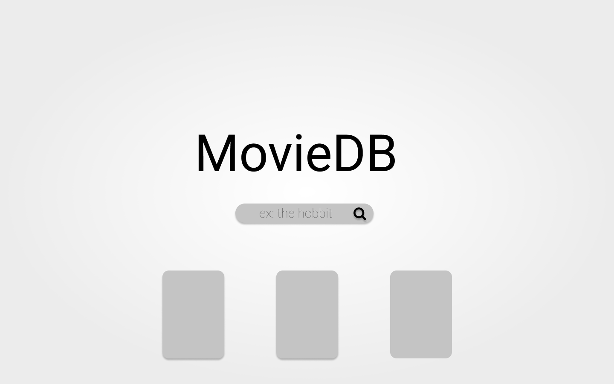
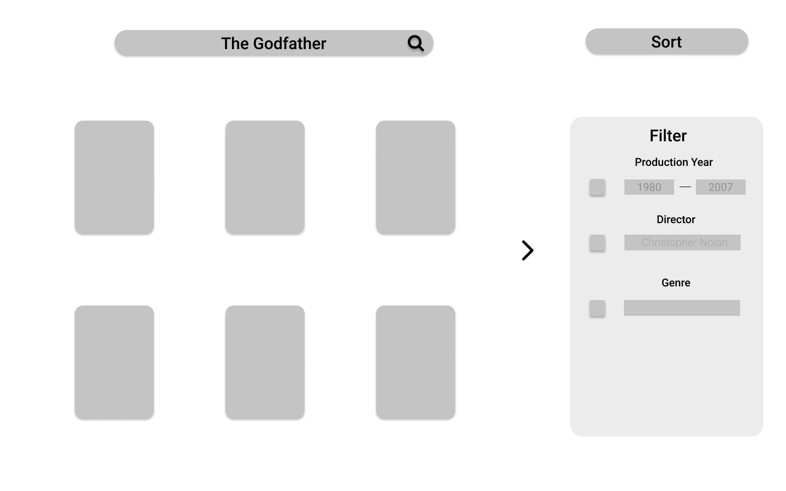
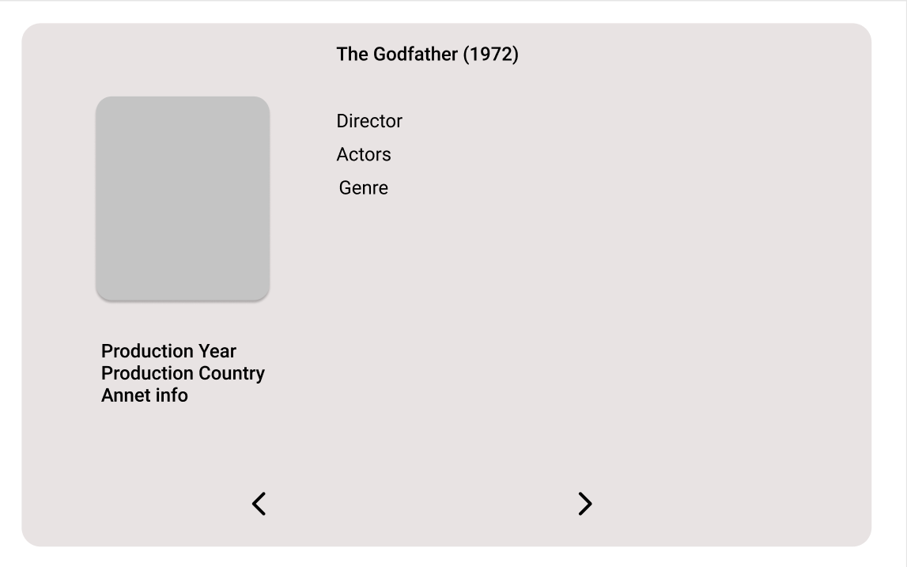
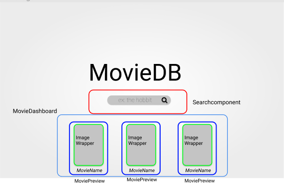
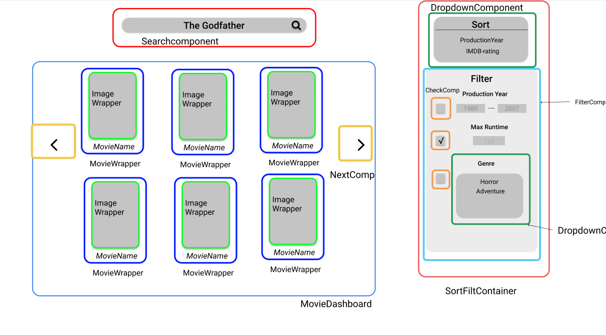
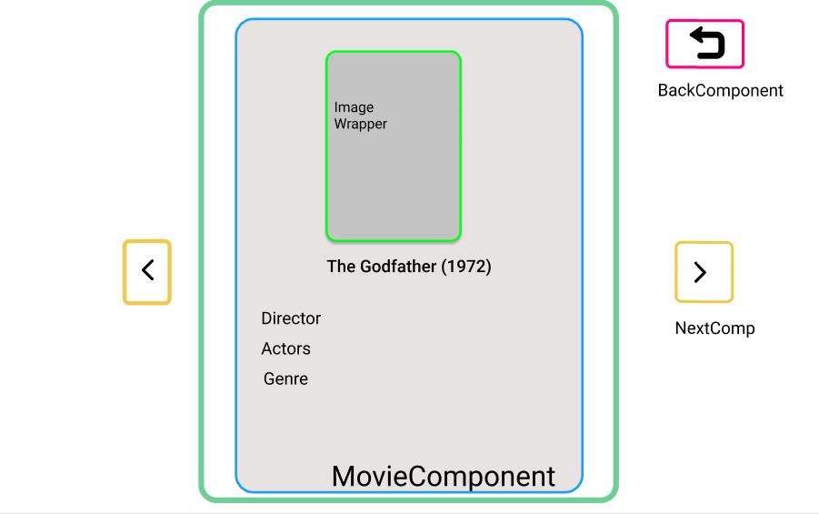
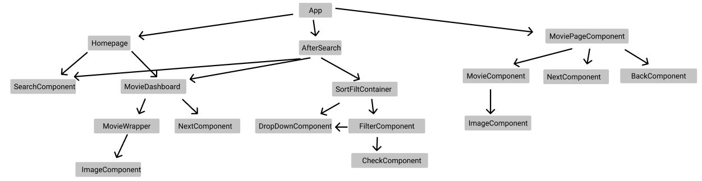
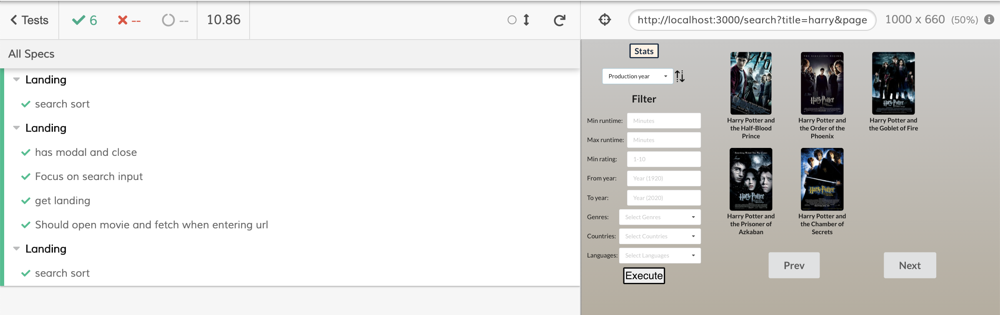

# Prosjekt 3

# Installering av prosjekt

Du finner prosjektet her: http://it-2810-80.idi.ntnu.no

Hvis du vil kjøre frontenden lokalt kan du clone, og gjøre npm install, før npm run start.

## API Reference

GET /movies => fetch movies, params:  
GET /movies/:id => fetch en movie  
POST /user/registration => registrer bruker  
POST /user/vote/:id => vote på movie, krever følgende body: {value: int}  
GET /stats/\* => stats

## Figma & Component-identifisering

Vi startet prosjektet med å designe et førsteutkast til de viktigste sidene i frontend. Statistikksiden var ikke en idé fra begynnelsen, og er derfor ikke inkludert.

Deretter lagde vi en komponentstruktur og identifiserte hvilke komponenter som gjengår i prosjektet, og hvordan komponentene skulle interagere med hverandre.

Vi lagde også et komponent-tre for å spesifisere hvilke komponenter som gjenbrukes og for å tydeliggjøre strukturen.

Sluttproduktet ble ikke identisk med designet i figma, men vi følte allikevel at arbeidet i Figma var til stor hjelp. Det gjorde det mye lettere å vite hvilke oppgaver som gjenstod, hvordan disse skulle implementeres med resten, og deretter hvordan produktet skulle utvikles. I tillegg gjorde visualiseringene det veldig lett å snakke om hvordan vi ville designe nettsiden.

## Oppbygning av nettsiden

Nettsiden består i hovedsak av fire ulike type sider. En forside, søkeside, filmside og statistikkside.

På forsiden er det søkefelt, link til statistikk og tre tilfeldige valgt filmer. Disse tre filmene er enten de verste/beste filmene til eksempelvis IMDB eller tre pseudo-tilfeldige filmer. Filmene fører deg til en filmside for den spesifikke filmen du trykket på.

Søkesiden brukes for å vise resultater etter søk. Her kan man også filtrere og sortere filmene og trykke seg videre til en spesifikk film eller til statistikksiden.

Filmsiden viser informasjon om en spesifikk film.

Statistikksiden visualiserer noe av dataen fra databasen i form av tall, bar chart, line chart og pie chart.

Det er også en dev-side (/devops) hvor vi togglet mellom lokal og online backend.

## Brukerinteraksjon

Vi har lagt til et eget vurderingssystem for brukervurderinger. For å vite hva våre brukere synes om filmene, kan alle brukere rate videoer de ser på på filmsiden (/movies/:id).
For å gjøre dette må man registrere en annonym bruker. Man oppretter en bruker ved å trykke "Start" i modalen som poper opp når man åpner siden. Brukeren består kun av en ID, og vi lagrer bruker-id-en, samt klokkeslettet den ble opprettet. Grunnen til at vi lagrer klokkeslettet man opprettet brukeren var at vi ønsket å implementere en history function. Denne informasjonen er dermed tilgjengelig om det blir ønskelig i fremtiden.

Når man stemmer på en video lagres bruker-id'en, samt klokkeslettet man har stemt på videoen. Grunnen til at vi lagrer brukerid-en og trengte annonyme brukere, er at vi ønsket at man kun skal kunne stemme på en film én gang.

Dette blir implementert ved å hente alle filmer en bruker har vurdert slik at knappen kun blir synlig dersom man ikke har stemt på filmen før.
I tilegg er det en unik constriant mellom movieid og userid i databasen.

Dersom man ønsker å oppdatere sin vurdering av en film støtter backenden dette, men vi valgte å ikke implementere dette i frontenden da vi ønsker at brukere skal vurdere flere filmer, og ikke bli tilfredsstilt med testing av funksjonen ved å oppdatere rating av én film. Dette kan eventuelt endres på et senere stadie når det er en god del bruker-ratinger lagret.

## State management

For å holde styr på states hentet fra databasen, har vi brukt redux. Dette har tillatt oss å unngå passing av props nedover komponenter, og åpner for å håndtere error og loading på en god måte. Loading og error blir utnyttet i hver komponent redux-states brukes for å enten throwe error eller vise loading-screen. Vi har erfart at dette fungerer meget godt for å endre og håndtere states i større prosjekter. Vi har i hoevsak brukt det for å holde styr på og fetche filmer. I tillegg er det brukt for å hente eksempelvis alle kategoriene filmene har og totalt antall filmer.

Vi har også brukt url-en for å holde styr på tilstanden til nettsiden. Props til backenden blir lagret og hentet fra url-en. Dette tillater oss å bruke denne for lagring og opphenting av states, noe som medfører mindre kode relatert til states i koden.

## Biblioteker

Vi har i hovedsak benyttet oss av semantic ui og recharts.

For å sørge for et godt design samt gjennomgående estetikk har vi brukt Semantic-UI. Det er brukt for dropdowns, buttons, header og lignende. Vi har brukt Semantic-UI de stedene vi føler vi får mye igjen for det, og skrevet css der dette lar seg gjøre fint og kort. Vi har erfart problemer ved å bruke Semantic-UI fremfor egenproduserte komponeneter, fordi det er en warning som forekommer på grunn av dropdown-komponenten til Semantic. Videre vil vi være mer påpasselige når det kommer til bruk av biblioteker.

Recharts har vært avgjørende for å visualisere dataen slik vi ville. Det er brukt for pie chartet, bar chartet og line chartet. Det er allikevel en del ekstra egenprodusert kode for å skape tooltip ved hover på pie chartet og lignende.

## Backend

Vi har valgt å bruke express, skrevet i typescript for å imøtekomme det vi tolket som oppgavens krav. Backenden er delt opp i forskjellige end-points, hvor det mest brukte er /movies/. Her skjer all filtrering og sortering av filmer.

Backenden bruker node-pg for å koble til postgres. Et library so gjorde at vi kunne skrive sql selv, uten å måtte bruke ORM-s. Dette passet gruppen godt da vi hadde forskjellig erfaring med ORM-biblioteker, men alle hadde forståelse for SQL. Dette ga også veldig fleksibilitet i utviklingen da vi enkelt legger til felter, eller gjøre en annen aggregering.

For å kjøre backenden, brukte vi Docker da det er et fantastisk verktøy for hosting. Vi satt opp scripts for å pulle fra git, bygge image og redeploye backenden.

I frontend-repoet har vi en /devops-side hvor man enkelt kunne endre om man ønsket å bruke den deployede backenden, eller om man ønsket å bruke en lokal backend. Dette var greit å implementere tidlig da vi raskt kunne bytte backend dersom noe breaket for å finne ut hva som kunne være problemet.

## Database

Ettersom vi ønsket å lage en statistikk-side tenkte vi det hadde vært kult å bruke en sql-database da aggregeringer kan hente mye kul statistikk. Dette har funket veldig bra!

Vi kjører databasen av et docker-image i backenden, slik at vi enkelt kunne endre volume ettersom vi jobbet med importion av data. Dette gjorde backups lett, og gjorde utviklingen mer fleksibel. I tillegg åpnet dette for at vi kunne kjøre database lokalt med en enkel kommando. Riktignok valgte vi å ikke gjøre dette da den distribuerte database hadde så mye data etter hvert at det ble mye styr å ha lokale databaser da strukturen kom på plass.

Dataen i databasen har vi hentet på følgende måte:

1. Scrape topp 5000 filmer fra IMDB. Vi valgte å fetche fra en availability zone i USA (Ohio-us-west) ettersom vi så at filmer fra USA som regel var mer tilgjengelig i OMDB.
2. For hver film, fetch data fra OMDB -> dropp de filmene som ikke har data lagret i OMDB (4020). Dermed gjenstår 980 filmer.
3. Clean up data og importer til database.

For denne prosessen lagde vi python scripts, som viste seg å være meget gunstig da vi hadde glemt forskjelige felt underveis. Dette gjorde prosessen med å legge til et felt meget enkel.

Totalt består databasen av 17 tabeller. Sammen lagrer disse dataen som er nødvendig for å presentere siden vår.

Vi ønsker ikke at dere skal kunne slette data i databasen, og dere finner dermed ikke database-passord i repoet. Dere kan dermed ikke kjøre backenden lokalt. Derimot er den deployet på it-2810-80.idi.ntnu.no:3000, etter at vi måtte bruke port 3000. Vi skulle gjerne kjørt den av /backend på port 80. Beklager portvalg.

### External DB - OMDP API

OMDP API er en RESTful service for å hente ut filminformasjon.
http://www.omdbapi.com/

## Nginx

Vi bruker Nginx for å serve applikasjonen vår på VM-en. Her har vi satt opp en server for å svare på port 3000 som reverse proxyer forespørseler til backenden vår, i tillegg til å serve statiske bilder av posters, actors og directors. Det statiske innholdet ligger lagret på disk, mens backenden proxyes til docker-containeren vår.

I tillegg har vi en server som server statisk innhold for frontenden. Dette skulle vi gjerne bygget med docker, og gjerne deployet via en docker-container med proxy til en nginx-container, men vi hadde dessverre ikke nok minne tilgjengelig, så vm-en kunne ikke bygge imaget. Ettersom vi ikke ønsket å bruke så mye tid på frotend deployment, valgte vi ikke å sette opp build-CD-s med circle eller gitlab ci/cd, men heller lage et script for å bygge lokalt og så "scp"-e filene til servere.

## Bilder

Som dere ser har vi mange bilder i applikasjonen. Alle disse har vi lastet til vm-en og server av den. Dette gjorde vi da vi ønsket å laste posterene raskt, i tilegg til at vi ønsket å legge til bilder av actors og directors. Vi har brukt python-scripts for å scrape denne informasjonen fra IMDB, og deretter laste dem ned. Dette kan man automatisere ved innsetting av nye filmer, men vi har ikke satt opp cron jobs for dette da vi ikke legger til nye flimer per nå. Det er noen actors og directors som ikke har bilde på imdb, og her kunne vi sikkert gjort en jobb manuelt, men vi har ikke prioritert dette. Det er også lagt til noen easter eggs med bilder av oss og kjente politikere på enkelte av de uten bilde. Lykke til:)

## Tester

Vi har testet prosjektet med enehetstesting og snpashottester fra jest for frontend. Her har vi testet mange komponenter i forskjellige deler av koden, samt noen funksjoner. Dette har hjulpet oss under prosjektutviklingen med å raskere kunne oppdage feil og rette dem opp.

I tillegg har vi end-to-end-testing via cypress. Dette er tester som tester at funksjonaliteten i frontend er implementert riktig. Ved å launce en versjon av frontenden i chrome, vil cypress kunne gjøre kommandoer vi programmerer for å endre hva som blir servet i frontend. Dermed kan vi instruere frontenden til å gjøre endringer og hente data fra backenden.

Deretter tester vi om svaret fra backenden blir presentert på riktig måte i frontenden, og på riktig format/filter. Dette gjør at vi har valgt å ikke implementere enhetstester i backenden da ende-til-ende-testene er såpass omfattende at backend-svarene blir tatt hånd om her. Man kan argumentere for at enhetstetsrer av funksjonen brukt i backenden isolert sett ville vært fordelaktig å implementere, men vi mener at det er et fåtall av disse, og ende-til-ende-testene vil også breake om disse feiler.

Nettsiden er også testet med på flere nettlesere, og bekreftet at fungerer på:

- Google Chrome
- Microsoft Edge
- Microsoft Edge on Mac
- Safari
- Firefox
- Opera

For å teste på forskjellige browsere har vi også benyttet oss av Browser Stack, som gjør testing meget enkelt.

Vi har også benyttet oss av cross-unit-testing, og ser at nettsiden fungerer fint på alle enheter og størrelser vi har testet. Dette er hovedsaklig sørget for ved bruk av flexbox og media queries. Alle sidene skalerer fint ned til de minste mobilstørrelsene. Vi har simulert mobilenheter igjennom Google Chrome sitt verktøy. Dette hjalp spesielt når det kom til å gjøre siden responsiv på selv de minste mobileenheter (Iphone SE/5) og for eksempel ipad pro, Pixel 2 og Iphone X.

## Git, issues og merge requests

Gruppen har lært mye om god bruk av git, issues og Gitlab.
Vi har brukt issues med relevante labels til skapelsen av hver branch. Labelsene var "frontend", "backend" og "in progress", noe som gjorde at det var lett for alle gruppemedlemmene å ha konstant oversikt over progresjonen., og å se hvor det gjenstod arbeid.
Vi har også innført gode rutiner for å kommentere på hverandres merge requests.

## Samarbeid og læring

Vi har samarbeidet godt ved direkte kommunikasjon, samt kommenteringer på issues og merge requests. Dette har ført til bedre oversikt og økt forståelse. I tillegg har vi flere ganger påpekt forbedringspotensiale i merge requests. Vi har også parprogrammert for å øke gruppas forståelse som helhet og sørge for at alle er godt kjent med prosjektet. Vi har hatt delvis definerte arbeidsoppgaver, noe som har medført at man først og fremst kan fokusere på å lære seg det som er relevant for ens eget kunnskapsnivå.

## Credits

Et par ikoner på nettsiden er hentet fra https://icons8.com/. Dette gjelder tilbakeknappen og sorteringsknappen.
I tillegg har vi hentet bakgrunnsbilde fra Isabella Conti.

- Tilbakeknapp: https://icons8.com/icon/11511/reply-arrow
- Sorteringsknapp: https://icons8.com/icon/41198/up-down-arrow
- Bakgrunnsbildet er laget av Isabella Conti - https://www.behance.net/gallery/82902895/Inner-Landscape-Personal-project
